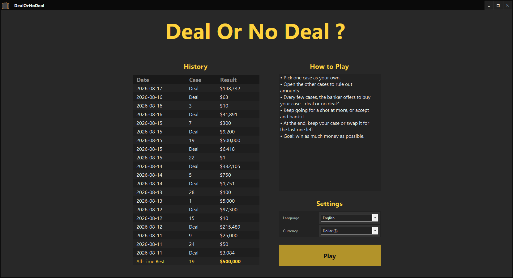
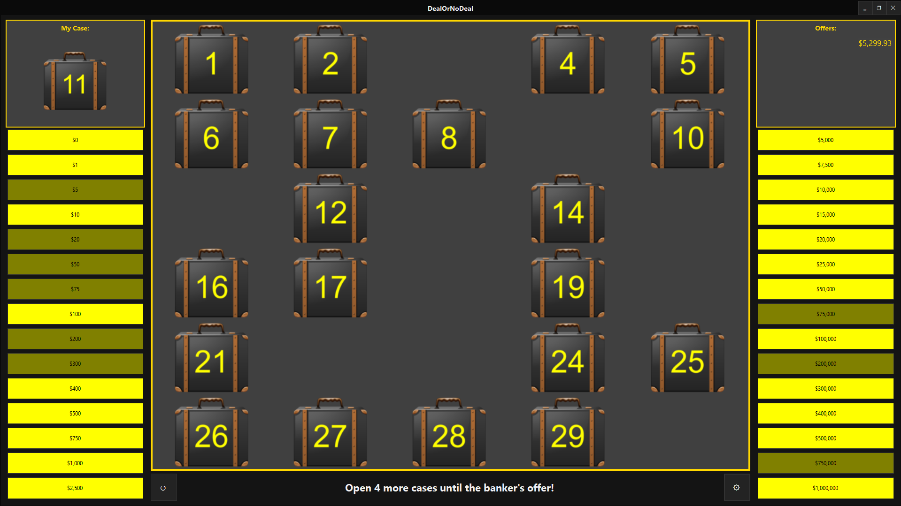

# Deal or No Deal

A WinForms recreation of the "Deal or No Deal" game show, built on top of the [CustomWFUI](https://github.com/Erik513/CustomWFUI) component library.

## What it does

- 30 cases, each hiding one of the show's classic money amounts ($0 up to $1,000,000)
- A banker who makes increasingly realistic offers as the round progresses — never above the fair average of what's still in play, dampened further the more the remaining amounts vary
- A dramatic slow-reveal animation for the final keep-or-swap decision
- A home screen with your last 20 games, your all-time best, and inline language/currency settings
- Presented in English, with German also available as a second language — and currency switching between $ and € — both apply live, no restart needed
- Checks GitHub for new releases on startup and can update itself in place

## Requirements

- Windows 10/11, 64-bit
- Nothing else — the published build is a single, fully self-contained `.exe` that bundles the .NET runtime.

## Getting started

Download the latest `DealOrNoDeal.exe` from the [Releases page](../../releases) and run it. No installer, no other files needed.

## License

All rights reserved.
